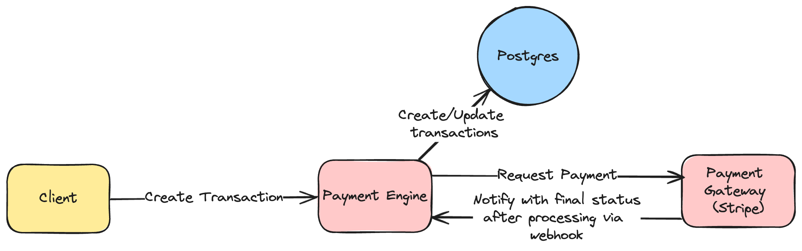
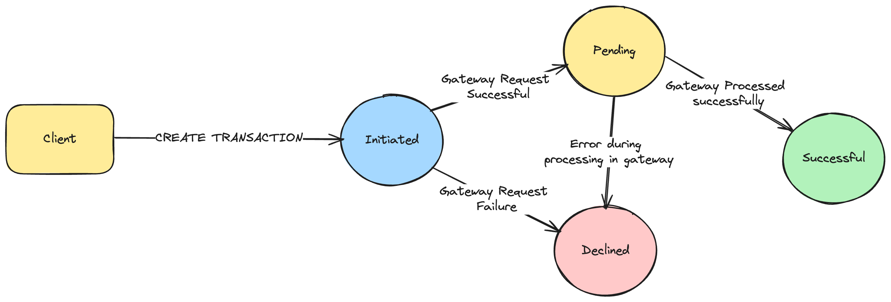

# Payment Engine

## Overview

This project implements a payment engine for processing transaction statuses in a financial application. It handles various transaction states (`initiated`, `pending`, `successful`, `declined`), provides real-time updates, and ensures data integrity and security.

## Table of Contents

- [Functional Requirements](#functional-requirements)
- [Non-Functional Requirements](#non-functional-requirements)
- [Technologies Used](#technologies-used)
- [Database Schema](#database-schema)
- [System Design And API Endpoints](#system-design-and-api-endpoints)
- [Running the Application](#running-the-application)
- [Usage](#usage)
- [Testing](#testing)

## Functional Requirements

1. **Transaction State Management**: The system should be able to manage different transaction states (`initiated`, `pending`, `successful`, `declined`). It should accurately and securely handle state transition workflows.

2. **Real-Time Updates**: The system provides real-time updates for transaction statuses using event-driven mechanisms (webhook).

3. **Error Handling and Recovery**:

- Robust Error-Handling Mechanisms: The system is designed to handle various types of errors, including exceptions (unexpected errors that occur during execution), timeouts (when a request to a service takes too long), and network failures (when there's a problem with the network connection). These mechanisms ensure that the system can handle these errors gracefully without crashing or losing data.

- Informative Error Messages and Logs: When an error occurs, the system will log detailed information about the error. This includes an error message that describes what went wrong, and a stack trace that shows the sequence of function calls that led to the error. These logs can be used for troubleshooting and debugging, making it easier to identify and fix the cause of the error.

4. **Integration with Payment Gateways**: The system is be able to process transactions with different payment gateways (e.g., Stripe, PayPal). For the purpose of this project, a mocked service was implemented to play the role of the payment gateway.

5. **Testing**: The system includes unit tests to validate functionality and edge cases.

## Non-Functional Requirements

1. **Scalability**: The system is be designed to handle a high volume of transactions and should be able to scale horizontally as demand increases.

2. **Performance**: The system processes transactions and provide updates in real-time with minimal latency.

3. **Reliability**: The system is reliable and available, with minimal downtime. It should handle errors gracefully and recover from failures quickly.

4. **Security**: Using Mock API key in the payment gateway to verify the request.

5. **Maintainability**: The system should be easy to maintain and extend. It follows clean code principles and SOLID principles.

## Technologies Used

- NodeJS
- ExpressJS
- PostgreSQL (Main Datastore)
- Sequelize (ORM)
- Jest (Testing)
- Docker (Containerization)

## Database Schema

### Transactions Table

| Column Name | Data Type | Description                   |
| ----------- | --------- | ----------------------------- |
| id          | INTEGER   | Primary key                   |
| amount      | INTEGER   | The amount of money           |
| status      | STRING    | The status of the transaction |
| gateway     | STRING    | The used payment gateway      |

### System Design





## Running the Application

1. Ensure Docker and Docker Compose are installed on your system.
2. Clone the repository and navigate to the project directory:

```bash
git clone https://github.com/Ghallab98/payment-engine.git
cd payment-engine
```

3. Rename the `.env.example` file to `.env`.
4. Start the project:

```bash
docker-compose up
```

this will start the application, the payment gateway and the database.

## Usage

Create a transaction:
Send a POST request to http://localhost:3000/v1/transactions endpoint with transaction data in the request body.

Body example:

```json
{
  "amount": 2500,
  "gateway": "stripe" // or "paypal"
}
```

Update transaction status:
By creating a transaction, it starts the flow with status `initiated`, then a request is sent to the gateway to process the transaction, if no errors occur the transaction status will change to `pending`. The gateway will process the transaction then notify the engine via the webhook with the final status either `success` or `failed`.

CRUD operations are available for transactions.

## Testing

To run unit tests, execute the following command:

```bash
docker-compose run --rm app npm test
```
